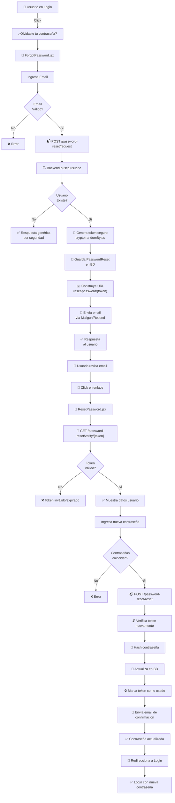
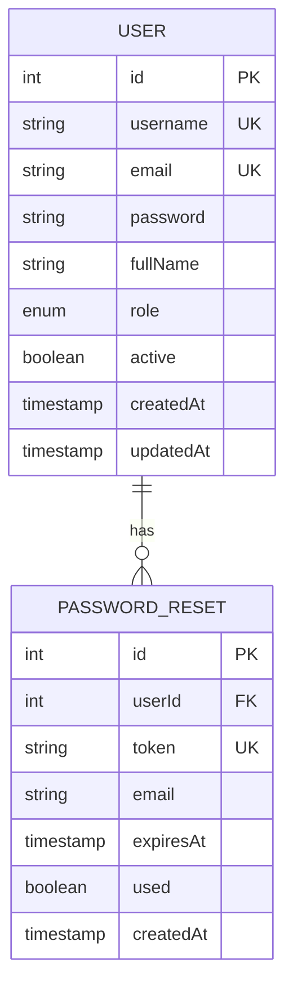

# Diagrama de Flujo - Recuperación de Contraseña

## Flujo Completo



## Base de Datos



## Tabla PasswordReset

| Campo | Tipo | Descripción |
|-------|------|-------------|
| id | INT PRIMARY KEY | ID único |
| userId | INT FOREIGN KEY | Relación con User |
| token | STRING UNIQUE | Token de recuperación |
| email | STRING | Email para confirmación |
| expiresAt | TIMESTAMP | Expiración en 1 hora |
| used | BOOLEAN | Flag de una sola use |
| createdAt | TIMESTAMP | Fecha de creación |

## Seguridad de Tokens

```
Generación:
random bytes → 32 bytes → hex string
❌ Predecibles
✅ Criptográficamente seguros
✅ Únicos
✅ No reversibles

Ejemplo Token:
a1b2c3d4e5f6g7h8i9j0k1l2m3n4o5p6q7r8s9t0u1v2w3x4y5z6
```

## Seguridad de Contraseña

```
Nueva contraseña
      ↓
bcryptjs.hash()
      ↓
Rounds = 10 (configurable)
      ↓
$2a$10$XL6Zr7VlvXHLflU8kTvu2O8d71wicHUl/.VoPC6Axx6AkPOPTo2yq
```

## Estados Posibles

```
Token Válido:
✅ Existe en BD
✅ No está marcado como usado
✅ No ha expirado (< 1 hora)
→ Usuario puede resetear contraseña

Token Inválido:
❌ No existe en BD
✅ Ya fue usado
✅ Expiró
→ Usuario debe solicitar nuevo token
```
